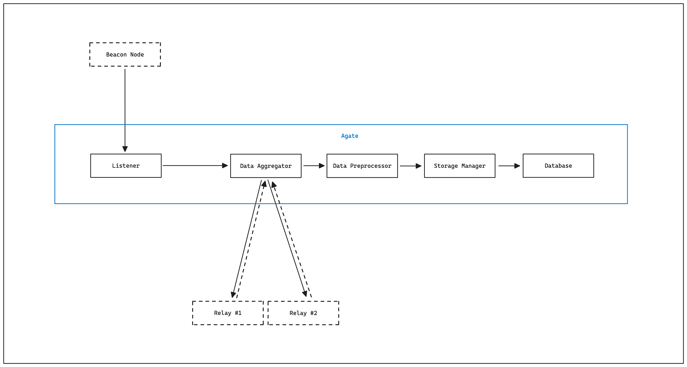

# <h1 align="center"> Agate </h1>

<p align="center">
    
</p>

<p align="center">
    An Ethereum Relay Data Indexer.
</p>

Cover by [DALL-E](https://openai.com/dall-e-2/).

## Table of Contents

- [Introduction](#introduction)
- [Acknowledgments](#acknowledgments)
- [Architecture](#architecture)
- [Prerequisites](#prerequisites)
- [Getting Started](#getting-started)
  - [Build the project](#build-the-project)
  - [Start the project](#start-the-project)
    - [Using the binary built from source](#using-the-binary-built-from-source)
    - [Using Docker Engine](#using-docker-engine)
- [Contributing](#contributing)
- [Authors](#authors)

## Introduction

The Ethereum block building landscape has evolved a lot since [The Merge](https://ethereum.org/en/roadmap/merge).

In an attempt to build the foundations of what will eventually become
[PBS](https://ethereum.org/nl/roadmap/pbs), mev-boost was developed and introduced new parties 
in the transaction lifecycle:
- **The Block Builders**: responsible for forging blocks using various sources of transactions.
- **The Relays**: responsible for aggregating block builder bids and distributing the most 
  valuables to the proposers.

Agate indexes the data exposed by a set of relays 
through their dedicated [Data Transparency API](https://flashbots.github.io/relay-specs/#/Data).

Using the collected data, we hope it'll be used to enlighten a bit more the MEV landscape.

## Acknowledgments

Before going in more details about the project, we would like to thank those entities and people 
for inspiring us to build Agate:
- [Eden Network](https://www.edennetwork.io/)
- [Toni Wahrstätter](https://x.com/nero_eth?s=21)
- [Flashbots](https://www.flashbots.net/)

## Architecture

Here is a schema of Agate's default architecture:
<p align="center">
    
</p>

Explained in simple terms, the internal components work like this:
- The Listener waits for new head events from the Ethereum Beacon node.
- Once a new event has been received - a new slot has been processed - the Data Aggregator 
  collects data from various relays.
- The collected data is preprocessed by the Data Preprocessor.
- And the Storage Manager is responsible for saving the preprocessed aggregated relay data in a 
  database.

## Prerequisites

To build the project, you'll need:
- [Docker Engine](https://docs.docker.com/engine/install/).
- [Golang 1.21.6](https://go.dev/doc/install).

To run the project, you'll need:
- A beacon API URL.

## Getting Started

This section describes how to build and start Agate.

### Build the project

To build Agate from source, run the following command:
```shell
go build -o main.go
```

To build Agate using Docker, run the following command:
```shell
docker build -t agate .
```

To build Agate using [Dagger](https://dagger.io/), run the following command:
```
dagger -m ./.dagger export binary
```

### Start the project

#### Using the binary built from source

If you want to start the project using the binary built from source, copy and customize the
[`agate-config.example.yaml`](./agate-config.example.yaml) configuration file.

Before executing the binary, make sure that you have a running postgres instance.

Then, run the following command:
```shell
./agate --config agate-config.yaml
```

#### Using Docker Engine

If you want to start the project using Docker, customize the
[`agate-config-docker.yaml`](./agate-config-docker.yaml) configuration file.

Here, the postgres instance is provided as part of the [`docker-compose.yaml`](./docker-compose.yaml)
configuration file.

To run both agate and postgres using Docker, run the following command:
```shell
docker compose up # optional: -d to run the containers in detached moe. 
```

### Test the project

Check out [the dedicated file](.dagger/README.md)

## Contributing

Check out [the dedicated file](./CONTRIBUTING.md)!

## Authors

This project is currently being maintained by the 🕵️ at [Quartz Technology](https://github.com/quartz-technology).
